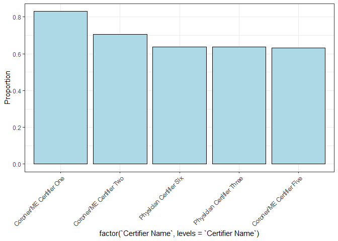

<!-- README.md is generated from README.Rmd. Please edit that file -->

# dqa4mortality: Mortality Data Quality Assessment Framework

<!-- badges: start -->

<!-- badges: end -->

The National Vital Statistics System (NVSS) is managed by the U.S.
Centers for Disease Control and Prevention and is the system of record
for all vital events (e.g., births, deaths) in the United States. This
system, for example, is used to manage approximately 2.8 million death
records annually and was constructed to ensure accurate and timely data
availability (NCHS 2024). Death certificate data, however, have at times
been found to incomplete, inaccurate, and untimely, affecting the
utility of the death certificate data ([Flagg
2021](https://stacks.cdc.gov/view/cdc/100414)). To address some of these
challenges, over the last decade, 54 of 57 jurisdictions implemented an
electronic death reporting system (EDRS). These EDRSs allow for
electronic capture of data, thus gaining efficiency in data sharing and
reporting.

Although the use of EDRSs, especially with embedded edit check tools
(e.g., [Validations and Interactive Edits Web
Service](https://www.cdc.gov/nchs/data/nvss/modernization/VIEWS-Technical-User-Info-508.pdf)),
has improved data quality, [challenges persist (Flagg
2021)](https://stacks.cdc.gov/view/cdc/100414). Comprehensive,
monitoring of data quality over time is essential to identify gaps and
identify opportunities to improve data quality.

dqa4mortality implements functions to execute Data Quality Assessment
Framework fort mortality data.

## Installation

You can install dqa4mortality from [GitHub](https://github.com/) with:

``` r
# install.packages("devtools")
devtools::install_github("nightingaleproject/Mortality-Data-Quality-Assessment-Examples/dqa4mortality")
```

## Data Requirements

Data used for metric calculation should have a format where each row
corresponds to one death record and each column corresponds to an
attribute for the death record, such as “Date Certified” or “Underlying
Cause of Death”. ICD codes included in the data should not include
periods (“.”).

You can load your CSV data by using the following function, replacing
“file_path” with the path to your mortality CSV:

``` r
library(dqa4mortality)
death_records <- load_death_records(file_path)
```

Example data is included in this package, called
*synthetic_death_records*. To look at the first few rows and columns of
this example data:

``` r
library(dqa4mortality)
head(synthetic_death_records[,1:33])
#>   Death Record Number Date of Death Date Certified
#> 1                   1    2023-01-01     2023-01-02
#> 2                   2    2023-01-01     2023-01-02
#> 3                   3    2023-01-01     2023-01-02
#> 4                   4    2023-01-01     2023-01-02
#> 5                   5    2023-01-01     2023-01-02
#> 6                   6    2023-01-01     2023-01-02
#>                     Certifier Name Certifier Type          Funeral Facility Sex
#> 1             ARNP Certifier Three           ARNP    Funeral Facility Three   F
#> 2             ARNP Certifier Three           ARNP      Funeral Facility One   F
#> 3        Coroner/ME Certifier Five     Coroner/ME      Funeral Facility One   M
#> 4       Physician Certifier Twelve      Physician Funeral Facility Eighteen   M
#> 5 Physician Certifier Twenty-three      Physician      Funeral Facility Ten   M
#> 6 Physician Certifier Twenty-three      Physician      Funeral Facility Ten   F
#>   Age Tobacco Use Contributed to Death Pregnancy Status Race White
#> 1  NA                          Unknown      No response          Y
#> 2  NA                               No             <NA>          Y
#> 3  NA                               No             <NA>          N
#> 4  NA                          Unknown             <NA>          Y
#> 5  NA                          Unknown             <NA>          Y
#> 6  NA                               No             <NA>          Y
#>   Race Black or African American Race American Indian or Alaska Native
#> 1                              N                                     N
#> 2                              N                                     N
#> 3                              N                                     N
#> 4                              N                                     N
#> 5                              N                                     N
#> 6                              N                                     N
#>   Race Asian Indian Race Chinese Race Filipino Race Japanese Race Korean
#> 1                 N            N             N             N           N
#> 2                 N            N             N             N           N
#> 3                 N            N             N             N           N
#> 4                 N            N             N             N           N
#> 5                 N            N             N             N           N
#> 6                 N            N             N             N           N
#>   Race Vietnamese Race Other Asian Race Native Hawaiian
#> 1               N                N                    N
#> 2               N                N                    N
#> 3               N                N                    N
#> 4               N                N                    N
#> 5               N                N                    N
#> 6               N                N                    N
#>   Race Guamanian or Chamorro Race Samoan Race Other Pacific Islander Race Other
#> 1                          N           N                           N          N
#> 2                          N           N                           N          N
#> 3                          N           N                           Y          N
#> 4                          N           N                           N          N
#> 5                          N           N                           N          N
#> 6                          N           N                           N          N
#>   Hispanic No Hispanic Mexican Hispanic Puerto Rican Hispanic Cuban
#> 1           Y                N                     N              N
#> 2           Y                N                     N              N
#> 3           Y                N                     N              N
#> 4           Y                N                     N              N
#> 5           Y                N                     N              N
#> 6           Y                N                     N              N
#>   Hispanic Other Underlying COD Record Axis COD 1 Record Axis COD 2
#> 1              N           G309              G309              R628
#> 2              N            C56               C56              <NA>
#> 3              N            X95               X95              T019
#> 4              N           C159              C159              <NA>
#> 5              N           C259              C259              <NA>
#> 6              N            C56               C56              <NA>
```

The raw CSV is also included in this repository; please see
[SyntheticDeathRecordData.csv](data/SyntheticDeathRecordData.csv).

## Functions

dqa4mortality includes several functions to assess quality of your given
mortality data. Functions beginning with “proportion\*” calculate
metrics across the whole dataset, whereas those beginning with
“certifier_proportion\*” calculate metrics by certifier within the
dataset.

Functions to assess data quality are:

- \*(proportion/certifier_proportion)\_not_certified_within_required_period()\*
  – Proportion of records that were not certified within the expected
  time – jurisdictions typically specify how quickly a death should be
  certified after the actual date of death.

- \*(proportion/certifier_proportion)\_with_incomplete_funeral_director_fields()\*
  – Proportion of records with at least one “funeral director” field
  incomplete – funeral directors are typically responsible for providing
  identifying information and some demographic information.

- \*(proportion/certifier_proportion)\_with_incomplete_medical_certifier_fields()\*
  – Proportion of records with at least one “medical certifier” field
  incomplete – the medical certifier is the medical professional or
  authorized person who determines the cause of death and manner of
  death.

- \*(proportion/certifier_proportion)\_with_incomplete_demographic()\* –
  Proportion of records with incomplete information for any of several
  demographic fields – demographic fields include variables such as age,
  race/ethnicity, and occupation.

- \*(proportion/certifier_proportion)\_with_one_cause()\* – Proportion
  of records with only one cause of death condition – multiple clinical
  conditions are typically reported by the medical certifier within Part
  I and Part II of the death certificate.

- \*(proportion/certifier_proportion)\_with_unsuitable_underlying()\* –
  Proportion of records with unsuitable underlying cause of death (UCOD)
  – unsuitable UCODs are those which are unknown and ill-defined;
  immediate and intermediate; and nonspecific.

For more information on inputs, outputs, and return values for each
function, see the help text for each function by prefacing it with a
question mark in your console. For example:

``` r
?proportion_not_certified_within_required_period
```

## Usage

Let’s start with assessing a simple metric on our synthetic data,
proportion with unsuitable underlying causes of death:

``` r
library(dqa4mortality)

prop <- proportion_with_unsuitable_underlying(
  synthetic_death_records,
  underlying_cause_of_death_column = "Underlying COD"
)
#> The proportion of records with unsuitable underlying cause of death is 0.24
```

We can see that it printed out the rounded proportion of records with an
unsuitable underlying cause of death. Additionally, if we look at the
value that it stored, `prop`:

``` r
print(prop)
#> [1] 0.24375
```

We can see that it stored the exact proportion in our variable. This can
be useful for noting to examine small changes in proportions over time.

Additionally, we can examine that same metric by certifier:

``` r
certifier_prop <- certifier_proportion_with_unsuitable_underlying(
  synthetic_death_records,
  underlying_cause_of_death_column = "Underlying COD",
  certifier_name_column = "Certifier Name"
)
#>                       Certifier Name Proportion
#> 7           Coroner/ME Certifier One 0.83098592
#> 11          Coroner/ME Certifier Two 0.70422535
#> 27           Physician Certifier Six 0.63636364
#> 31         Physician Certifier Three 0.63636364
#> 5          Coroner/ME Certifier Five 0.63095238
#> 24           Physician Certifier One 0.62500000
#> 20          Physician Certifier Four 0.54545455
#> 9           Coroner/ME Certifier Six 0.53781513
#> 6          Coroner/ME Certifier Four 0.50000000
#> 19          Physician Certifier Five 0.50000000
#> 8         Coroner/ME Certifier Seven 0.46794872
#> 10        Coroner/ME Certifier Three 0.39682540
#> 2                 ARNP Certifier One 0.33009709
#> 42             Unknown Certifier One 0.30769231
#> 12                  DO Certifier One 0.28571429
#> 4                 ARNP Certifier Two 0.23456790
#> 22          Physician Certifier Nine 0.23076923
#> 29           Physician Certifier Ten 0.21428571
#> 23      Physician Certifier Nineteen 0.20168067
#> 18       Physician Certifier Fifteen 0.19672131
#> 16      Physician Certifier Eighteen 0.19298246
#> 37  Physician Certifier Twenty-seven 0.19178082
#> 39  Physician Certifier Twenty-three 0.18617021
#> 14 Physician Assistant Certifier One 0.18421053
#> 25         Physician Certifier Seven 0.18181818
#> 34   Physician Certifier Twenty-five 0.18181818
#> 1                ARNP Certifier Four 0.17368421
#> 38    Physician Certifier Twenty-six 0.16719243
#> 17        Physician Certifier Eleven 0.16129032
#> 40    Physician Certifier Twenty-two 0.16000000
#> 30      Physician Certifier Thirteen 0.15789474
#> 36    Physician Certifier Twenty-one 0.15723270
#> 3               ARNP Certifier Three 0.13600000
#> 28       Physician Certifier Sixteen 0.13432836
#> 35   Physician Certifier Twenty-four 0.13333333
#> 33        Physician Certifier Twenty 0.12030075
#> 32        Physician Certifier Twelve 0.10810811
#> 21      Physician Certifier Fourteen 0.09259259
#> 26     Physician Certifier Seventeen 0.08219178
#> 13                  DO Certifier Two 0.06666667
#> 15         Physician Certifier Eight 0.06666667
#> 41           Physician Certifier Two 0.00000000
```

``` r
head(certifier_prop)
#>               Certifier Name Proportion
#> 7   Coroner/ME Certifier One  0.8309859
#> 11  Coroner/ME Certifier Two  0.7042254
#> 27   Physician Certifier Six  0.6363636
#> 31 Physician Certifier Three  0.6363636
#> 5  Coroner/ME Certifier Five  0.6309524
#> 24   Physician Certifier One  0.6250000
```

We can see that our proportion is printed by Certifier Name in our
dataset, and is sorted by the certifier with the highest proportion of
unsuitable underlying causes of death.

We could then use the data frame that’s returned to visualize our
certifiers with the highest proportions:

``` r
library(ggplot2)

ggplot(
  certifier_prop[1:5,], 
  aes(factor(`Certifier Name`, levels = `Certifier Name`), Proportion)
)+
  geom_col(color = "black", fill = "lightblue")+
  theme_bw()+
  scale_x_discrete(guide = guide_axis(angle = 45))
```



## Disclosure

Artificial Intelligence (AI) software was consulted in the development
of this code and to ensure that R and Python versions of the code run
identically.

## License

Copyright 2024 The MITRE Corporation

Licensed under the Apache License, Version 2.0 (the “License”); you may
not use this file except in compliance with the License. You may obtain
a copy of the License at

    http://www.apache.org/licenses/LICENSE-2.0

Unless required by applicable law or agreed to in writing, software
distributed under the License is distributed on an “AS IS” BASIS,
WITHOUT WARRANTIES OR CONDITIONS OF ANY KIND, either express or implied.
See the License for the specific language governing permissions and
limitations under the License.

### Contact Information

For questions or comments about this code repository please send email
to

    nvssmodernization@cdc.gov
